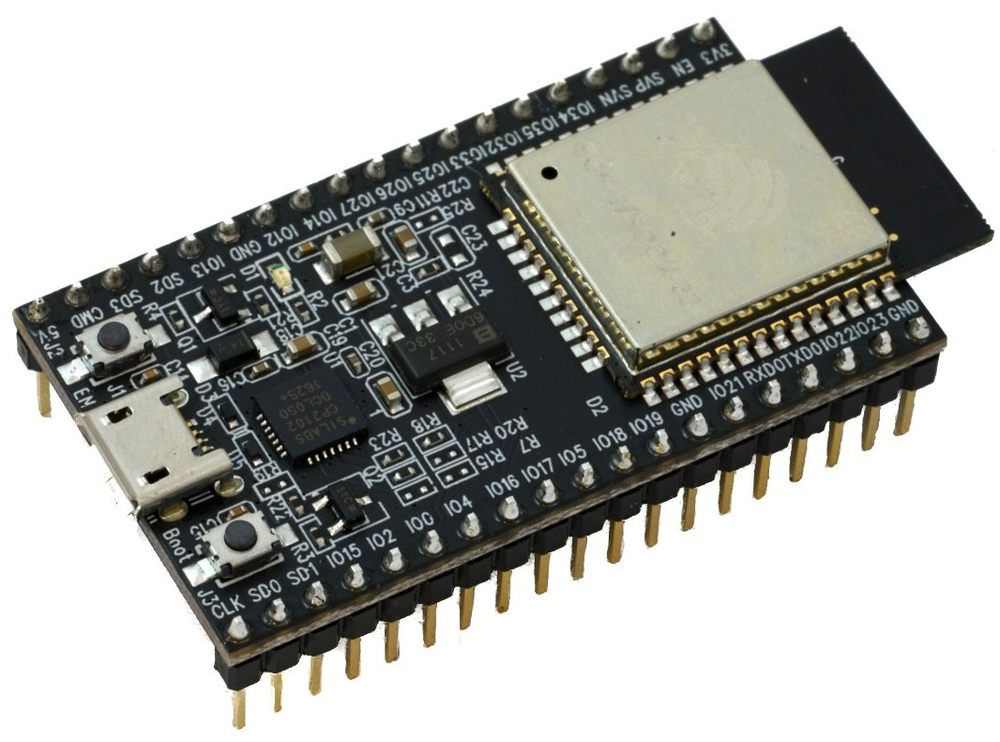
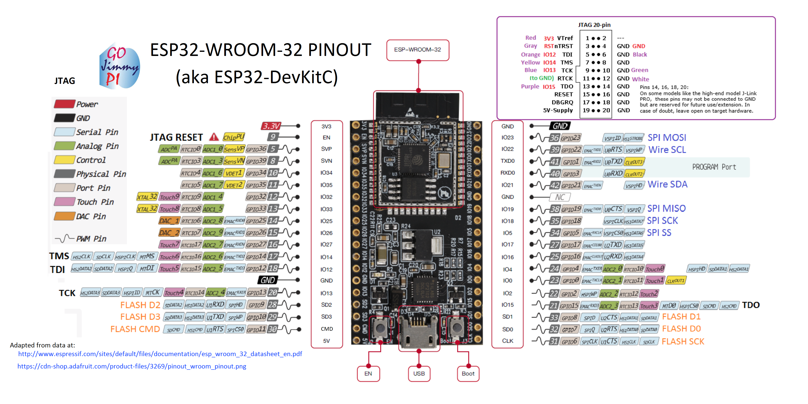

# ESP32 kit

## Installation

```bash
$ sudo usermod -a -G dialout $USER && \
sudo apt-get install git && \
wget https://bootstrap.pypa.io/get-pip.py && \
sudo python get-pip.py && \
sudo pip install pyserial && \
mkdir -p ~/Arduino/hardware/espressif && \
cd ~/Arduino/hardware/espressif && \
git clone https://github.com/espressif/arduino-esp32.git esp32 && \
cd esp32 && \
git submodule update --init --recursive && \
cd tools && \
python get.py
```

Also, install [`ArduinoJson`](https://github.com/bblanchon/ArduinoJson) package from Library Manager.

## Preparation

Create a file `user_data.h` in: `/esp32_scripts/esp32_peripherals/src/esp32_peripherals/include/` with the following structure as example:

```c++
#pragma once

static const char* ssid PROGMEM = "XXXX";
static const char* password PROGMEM = "XXXX";
static const uint8_t ip[] PROGMEM = {127, 0, 0, 1};
```

Don't forget to setup your network configuration and your ROS master IP.

## Execution

**NOTE:** Edit `esp32_peripherals.ino` with your own personal information!!

```bash
$ roslaunch esp32_peripherals run_esp32_node.launch
```




